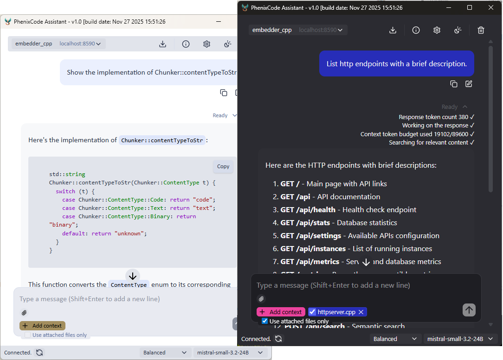

[](./LICENSE)

# PhenixCode Assistant

A self-hosted RAG system for querying codebases with AI. Index your code locally, search with semantic meaning, and get context-aware answers using local or cloud LLMs.

**Built for developers who want:**
- **Privacy** – Your code never leaves your machine
- **Zero subscriptions** – Run entirely on local models (no monthly fees)
- **Flexibility** – Switch between local and cloud LLMs as needed

Works offline with local models or integrates with OpenAI-compatible APIs. Your data, your infrastructure, your choice.



**Key features:** Local embeddings • Fast vector search (HNSWLib) • SQLite metadata • JWT auth • HTTP API • Single JSON config

**[Download release](https://github.com/nesall/phenixcode/releases/tag/v1.0.0)** | **[Quick start](https://github.com/nesall/phenixcode/blob/main/assets/QUICKSTART)**  

### Why Self-Host?

**GitHub Copilot:** $10-20/month, code sent to cloud, limited customization  
**PhenixCode:** One-time setup, runs on your hardware, customize everything  

### How to build

C++ 20 or newer is required.
nodejs 20 or newer is required.
If building in Linux, gcc-12 or newer is required.

```bash
# clone the repository and cd into it.

# Build both core and ui with a single command:

# Build in Linux
./package-lin.sh

# Build in MacOS
./package-mac.sh

# Build in Windows
package.bat


# To build either core or ui separately, use build_rel scripts

# e.g. building core only
./build_rel.sh

# or building ui only
cd ui/clients/webview
./build_rel.sh

```

### Features overview

Core Functionality:  
* Lightweight tokenization  
* Smart chunking with overlap  
* Local embeddings (llama-server + any choice of embedding model)  
* Both local and remote completion models of your choice
* Fast vector search (Hnswlib with cosine similarity)  
* Metadata storage (SQLite)  
* Incremental updates with file tracking  
* CLI + HTTP API  

API & Server:  
* HTTP API server (httplib)  
* REST endpoints (/api/search, /api/chat, /api/embed)  
* Metrics endpoint (JSON + Prometheus format)  
* Health checks  
* Graceful shutdown  

Security:  
* JWT token authentication  
* Password management (CLI-based)  
* Protected admin endpoints  
* Hashed password storage  

Deployment & Operations:  
* Console setup wizard (interactive)  
* Web setup wizard (password protected)
* Service installation scripts (Windows/Linux/macOS)  
* Structured logging (output.log + diagnostics.log)  
* Auto-start on boot (systemd/NSSM/LaunchAgent)  
* Release packaging (build_rel scripts)  

Configuration:  
* Template-based settings.json  
* Environment variable overrides  
* CLI parameter support  
* Multiple source types (directories, files, URLs)  


### CLI commands

Initial full embed of all sources from settings.json  
```./embedder --config settings.json embed```

Check for changes and update only what changed  
```./embedder update```

Continuous monitoring (checks every 60 seconds)  
```./embedder watch --interval 60```

Reclaim space used by deleted index items  
```./embedder compact```

Search nearest neighbours  
```./embedder search "how to optimize C++" --top 10```

Chat with LLM  
```./embedder chat```

Server on custom port with auto-update  
```./embedder serve --port 9000 --watch --interval 60```

Server without auto-update (manual trigger via /update endpoint)  
```./embedder serve```

Change Password - Method 1: Direct  
```./embeddings_cpp reset-password --pass NewPassword456```

Change Password - Method 2: Interactive (hides password input)  
```./embeddings_cpp reset-password-interactive```

Check password status  
```./embeddings_cpp password-status```


### Editing settings.json

Method 1:  
Edit file `settings.json` to configure settings manually (recommended on first time use).

Method 2:  
Open `http://localhost:8590/setup` to configure settings interactively.


### REST API endpoints

```bash
# Get list of API endpoints
curl -X GET http://localhost:8590/api

# Health check
curl -X GET http://localhost:8590/api/health

# Get document list
curl -X GET http://localhost:8590/api/documents

# Get configuration parameters (full config)
curl -X GET http://localhost:8590/api/setup

# Get available APIs (completion endpoints)
curl -X GET http://localhost:8590/api/settings

# Get running instances (usually one instance per project codebase)
curl -X GET http://localhost:8590/api/instances

# Get database statistics
curl -X GET http://localhost:8590/api/stats

# Get metrics (JSON)
curl -X GET http://localhost:8590/api/metrics

# Get Prometheus metrics
curl -X GET http://localhost:8590/metrics

# Setup configuration (POST)
curl -X POST http://localhost:8080/api/setup \
  -H "Authorization: Basic $(echo -n "username:password" | base64)" \
  -H "Content-Type: application/json" \
  -d '{
    "embedding": {...},
    "generation": {...},
    "database": {...},
    "chunking": {...}
  }'

# Search
curl -X POST http://localhost:8590/api/search \
  -H "Content-Type: application/json" \
  -d '{"query": "optimize performance", "top_k": 5}'

# Generate embeddings (without storing)
curl -X POST http://localhost:8590/api/embed \
  -H "Content-Type: application/json" \
  -d '{"text": "your text here"}'

# Add document
curl -X POST http://localhost:8080/api/documents \
  -H "Content-Type: application/json" \
  -d '{
    "content": "your document content",
    "source_id": "document_source_id"
  }'

# Trigger a manual update
curl -X POST http://localhost:8080/api/update

# Chat with optional context (streaming)
curl -X POST http://localhost:8080/api/chat \
  -H "Content-Type: application/json" \
  -d '{
    "messages": [
      {"role": "system", "content": "Keep it short."},
      {"role": "user", "content": "What is the capital of France?"}
    ],
    "sourceids": [
      "../embedder_cpp/src/main.cpp",
      "../embedder_cpp/include/settings.h"
    ],
    "attachments": [
      { "filename": "filename1.cpp", "content": "..text file content 1.."},
      { "filename": "filename2.cpp", "content": "..text file content 2.."}
    ],
    "temperature": 0.2,
    "max_tokens": 800,
    "targetapi": "xai",
    "ctxratio": 0.5,
    "attachedonly": false
  }'

# Initiate server shutdown that was started with an app key e.g. ./embeddings_cpp serve --appkey abc123
curl -X POST http://localhost:8590/api/shutdown \
  -H "X-App-Key: abc123" \
  -d '{}'  

# Authenticate  
curl -X POST http://localhost:8080/api/authenticate \
  -H "Authorization: Basic $(echo -n "username:password" | base64)"

  
```
